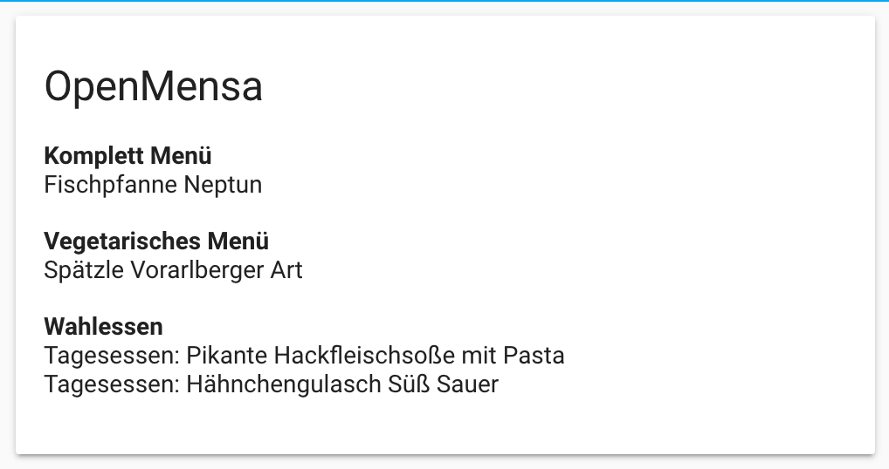
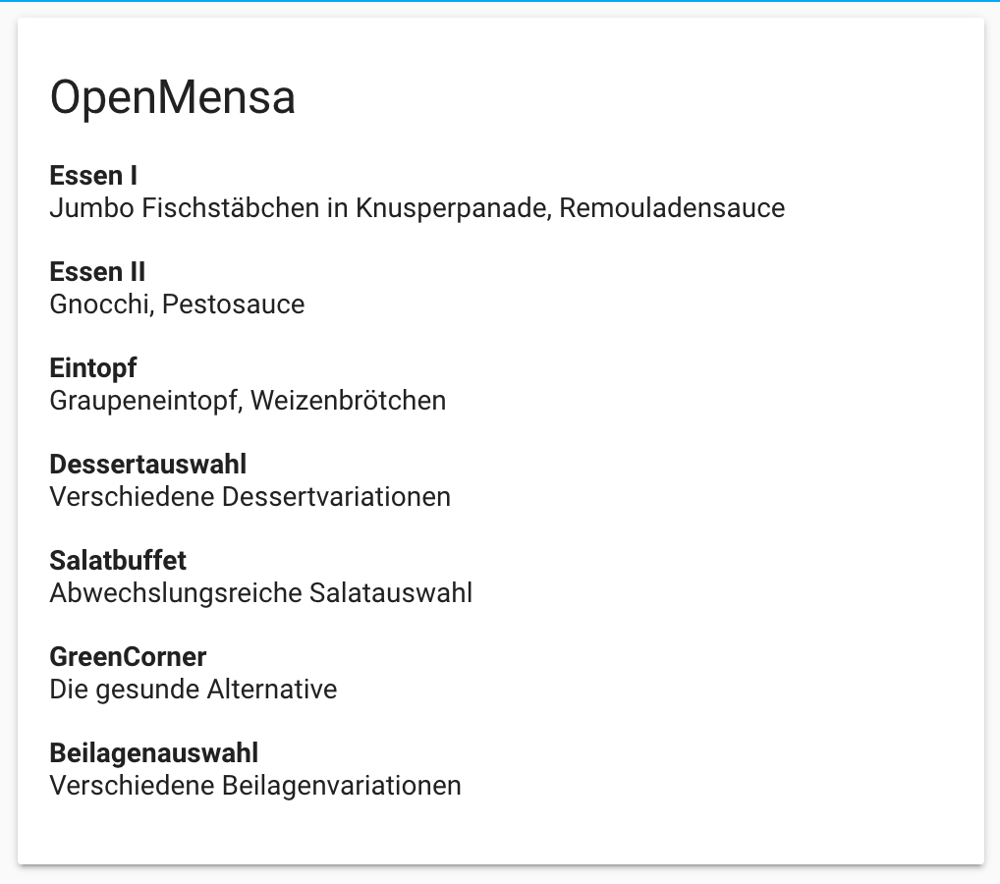

# OpenMensa Lovelace Card
This custom card diplays information from the [OpenMensa Sensor](https://github.com/Mofeywalker/openmensa-hass-component).


|Preview 1|Preview 2|
|-|-|
| | |

This card requires `type: js`.
```yaml
resources:
  - url: /local/custom-lovelace/openmensa-lovelace-card/openmensa-lovelace-card.js
    type: module
```